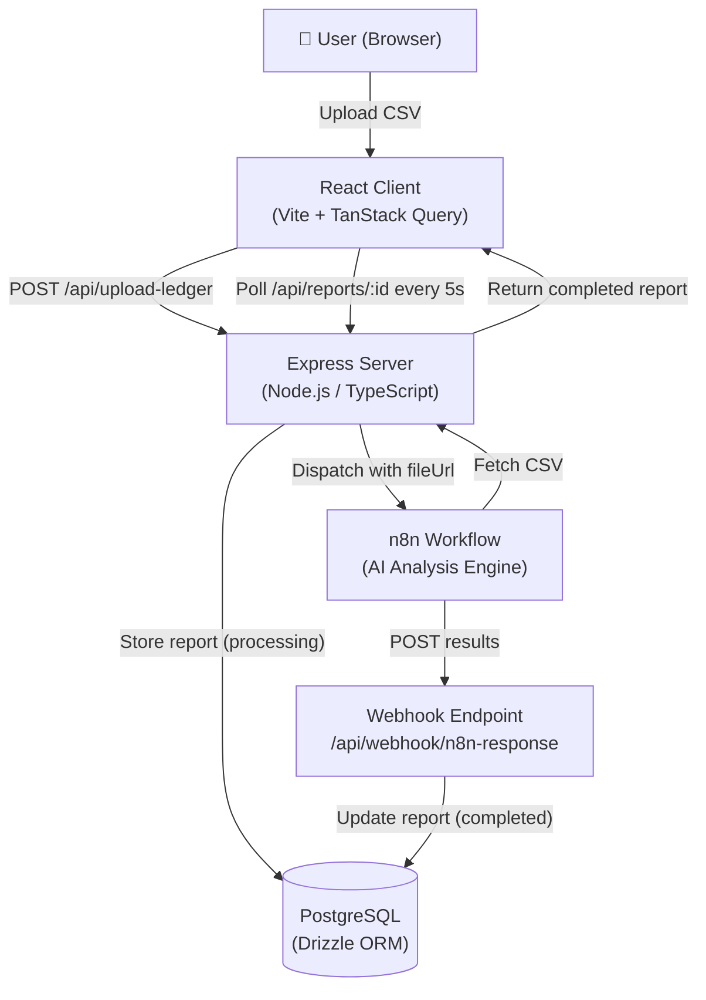

# FinPulse — Financial Health Dashboard

> AI-powered financial analysis platform. Upload a P&L ledger CSV, and FinPulse dispatches it to an n8n workflow for AI analysis — returning health scores, anomaly detection, revenue/expense charts, and natural-language commentary.

[](https://github.com/zihadimasumbillah/Asset-Manager/actions/workflows/ci.yml)
[](./LICENSE)

---

## Table of Contents

1. [Architecture](#architecture)
2. [Prerequisites](#prerequisites)
3. [Quick Start](#quick-start)
4. [Environment Variables](#environment-variables)
5. [npm Scripts](#npm-scripts)
6. [Project Structure](#project-structure)
7. [API Reference](#api-reference)
8. [Deployment](#deployment)
9. [Security](#security)
10. [Contributing](#contributing)

---

## Architecture



**Tech stack:**

| Layer        | Technology                                                |
| ------------ | --------------------------------------------------------- |
| Frontend     | React 18, Vite 7, TanStack Query, Recharts, framer-motion |
| Backend      | Express 5, Node.js 20, TypeScript                         |
| Database     | PostgreSQL 16, Drizzle ORM, Drizzle Kit                   |
| Validation   | Zod (shared between client and server)                    |
| AI Pipeline  | n8n (self-hosted or cloud)                                |
| File Uploads | multer (local disk, 10 MB limit)                          |
| Styling      | Tailwind CSS v3, Radix UI, shadcn/ui                      |

---

## Prerequisites

- **Node.js** ≥ 20 ([nvm](https://github.com/nvm-sh/nvm) recommended)
- **PostgreSQL** ≥ 14 running locally or via a cloud provider
- **n8n** instance (optional — skip for local development without AI processing)

---

## Quick Start

```bash
# 1. Clone the repository
git clone https://github.com/zihadimasumbillah/Asset-Manager.git
cd Asset-Manager

# 2. Install dependencies
npm install

# 3. Configure environment
cp .env.example .env
# Edit .env and fill in DATABASE_URL at minimum

# 4. Push database schema
npm run db:push

# 5. Start development server
npm run dev
# → Opens at http://localhost:5000
```

The app seeds 4 regional demo reports on first start (US Tech, UK Retail, APAC Manufacturing, Great Lakes Hospitality).

### Troubleshooting: Mock Data Not Displaying

**Symptom:** The dashboard shows no reports in both development and Vercel production.

**Root Causes:**

1. **Missing `DATABASE_URL`** — The app requires a PostgreSQL connection string. Without it, the server fails to initialize the database layer and cannot seed or retrieve reports.
2. **Seeding skipped in production** — A previous safeguard prevented `seedDatabase()` from running when `NODE_ENV=production`. On Vercel, `NODE_ENV` is always `production`, so demo reports were never created.
3. **User ID mismatch in seed data** — Demo reports were created with a hardcoded `user_id = "demo-user"`, but the authenticated user's actual ID is a UUID generated by the database. This caused all report queries to return empty results.
4. **Silent seed failures** — In serverless environments, seed errors were swallowed, making the failure invisible.

**Fixes Applied:**

- `seedDatabase()` no longer skips production. It is controlled by `SEED_DEMO_DATA` (default: `true`). Set `SEED_DEMO_DATA=false` to disable seeding.
- Demo reports are now created with the actual authenticated user's ID, eliminating the `user_id` mismatch.
- The server now **fails fast** at startup if `DATABASE_URL` is missing, with a clear error message.
- Vercel serverless seeding logs errors instead of ignoring them.

**Verification Steps:**

```bash
# 1. Ensure DATABASE_URL is set
echo $DATABASE_URL

# 2. Push schema to database
npm run db:push

# 3. Start dev server — seed runs automatically
npm run dev

# 4. Confirm reports exist
curl http://localhost:5000/api/reports
```

---

## Environment Variables

All variables are documented in [`.env.example`](./.env.example). Copy it to `.env` before starting.

| Variable             | Required         | Description                                           |
| -------------------- | ---------------- | ----------------------------------------------------- |
| `DATABASE_URL`       | ✅               | PostgreSQL connection string                          |
| `PORT`               | No (5000)        | Server port                                           |
| `NODE_ENV`           | No (development) | `development` \| `production` \| `test`               |
| `SEED_DEMO_DATA`     | No (true)        | Set to `false` to disable demo data seeding           |
| `SERVER_BASE_URL`    | ✅ in prod       | Public base URL for file download links sent to n8n   |
| `SESSION_SECRET`     | ✅ in prod       | 64-char hex string for session signing                |
| `N8N_WEBHOOK_URL`    | No               | n8n workflow trigger URL                              |
| `N8N_WEBHOOK_SECRET` | ✅ if n8n used   | 32-char hex string for webhook signature verification |

> **Never commit `.env`** — it is listed in `.gitignore`.

---

## npm Scripts

| Script                  | Description                                    |
| ----------------------- | ---------------------------------------------- |
| `npm run dev`           | Start development server (tsx, hot-reload)     |
| `npm run build`         | Build production bundle (Vite + esbuild)       |
| `npm start`             | Start production server (requires build first) |
| `npm run check`         | TypeScript type check                          |
| `npm run lint`          | Run ESLint                                     |
| `npm run lint:fix`      | Run ESLint with auto-fix                       |
| `npm run format`        | Run Prettier (write)                           |
| `npm run format:check`  | Run Prettier (check only)                      |
| `npm test`              | Run Vitest (single run)                        |
| `npm run test:watch`    | Run Vitest in watch mode                       |
| `npm run test:coverage` | Run tests with v8 coverage report              |
| `npm run db:push`       | Push Drizzle schema to database                |

---

## Project Structure

```
Asset-Manager/
├── client/                  # React frontend (Vite)
│   ├── index.html
│   └── src/
│       ├── App.tsx
│       ├── components/      # UI components
│       ├── hooks/           # Custom React hooks
│       ├── lib/             # queryClient, utils
│       └── pages/           # Route-level pages
├── server/                  # Express backend
│   ├── index.ts             # Server entry point
│   ├── routes.ts            # API route definitions
│   ├── storage.ts           # Database access layer (IStorage interface)
│   ├── db.ts                # Drizzle + pg pool setup
│   └── seed.ts              # Demo data seeding
├── shared/                  # Code shared between client and server
│   └── schema.ts            # Drizzle schema + Zod validators + TypeScript types
├── tests/                   # Test setup and cross-layer tests
├── .github/workflows/       # GitHub Actions CI/CD
├── .env.example             # Environment variable template
├── vercel.json              # Vercel deployment config
├── vitest.config.ts         # Vitest test configuration
└── drizzle.config.ts        # Drizzle Kit configuration
```

---

## API Reference

| Method | Path                        | Description                               |
| ------ | --------------------------- | ----------------------------------------- |
| `POST` | `/api/upload-ledger`        | Upload a CSV file and start AI processing |
| `GET`  | `/api/files/:filename`      | Download an uploaded CSV file             |
| `POST` | `/api/webhook/n8n-response` | Receive AI analysis results from n8n      |
| `GET`  | `/api/reports`              | List all reports for a user               |
| `GET`  | `/api/reports/latest`       | Get the most recent report for a user     |
| `GET`  | `/api/reports/:id`          | Get a specific report by ID               |

Full request/response documentation: [`docs/architecture.md`](./docs/architecture.md)

---

## Deployment

### Vercel (Recommended)

1. Install Vercel CLI: `npm i -g vercel`
2. Link project: `vercel link`
3. Add environment variables in the Vercel dashboard (see [Environment Variables](#environment-variables))
4. Deploy: push to `main` — GitHub Actions handles deployment automatically

See [`.github/workflows/deploy.yml`](./.github/workflows/deploy.yml) for the full pipeline.

**Required GitHub Secrets:**

| Secret              | Where to get it                            |
| ------------------- | ------------------------------------------ |
| `VERCEL_TOKEN`      | Vercel → Account Settings → Tokens         |
| `VERCEL_ORG_ID`     | `.vercel/project.json` after `vercel link` |
| `VERCEL_PROJECT_ID` | `.vercel/project.json` after `vercel link` |

---

## Security

> ⚠️ **Known Issues** — This application was built as a prototype. The following security issues are documented in [`code_review.md`](./code_review.md) and have not yet been remediated:
>
> - No authentication system (all endpoints are public)
> - Path traversal vulnerability in `/api/files/:filename`
> - Unauthenticated webhook endpoint
> - No rate limiting or CORS policy
>
> **Do not run this in production with real financial data until these are fixed.**

---

## Contributing

See [CONTRIBUTING.md](./CONTRIBUTING.md) for development workflow, branch conventions, commit format, and PR guidelines.
