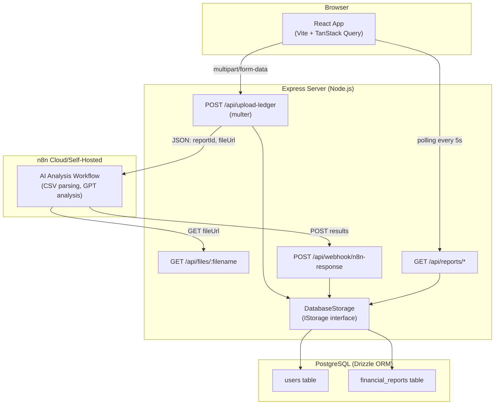
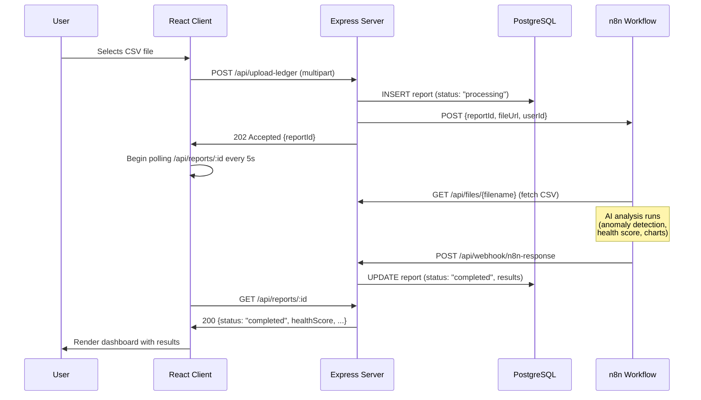
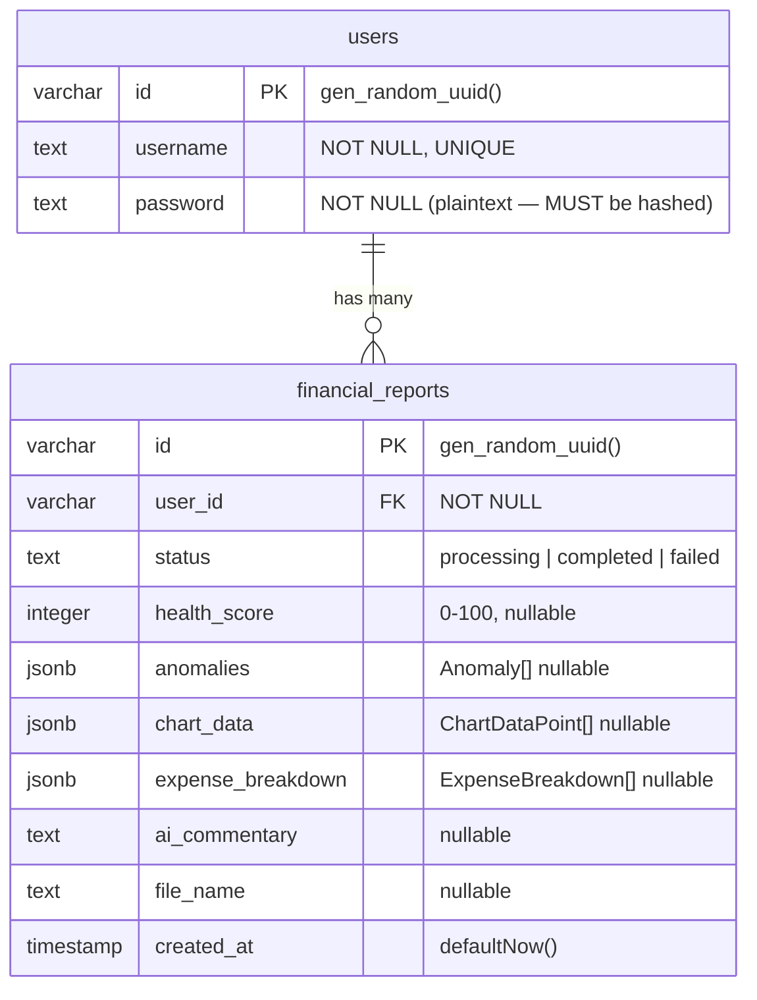

# Architecture Documentation — FinPulse

## System Overview

FinPulse is a full-stack financial health dashboard. Users upload CSV ledger files which are processed by an external n8n AI workflow. Results are stored in PostgreSQL and surfaced through a React dashboard.

---

## System Architecture Diagram



---

## Data Flow: Upload → Analysis → Display



---

## Database Schema



### JSONB Type Definitions

**`anomalies`** — `Anomaly[]`

```ts
{
  severity: "High" | "Medium" | "Low";
  description: string;
  variance: number; // percentage
}
```

**`chart_data`** — `ChartDataPoint[]`

```ts
{
  month: string; // e.g. "Jan"
  revenue: number;
  expenses: number;
}
```

**`expense_breakdown`** — `ExpenseBreakdown[]`

```ts
{
  category: string; // e.g. "Payroll"
  amount: number;
  percentage: number;
}
```

---

## API Endpoint Reference

### `POST /api/upload-ledger`

Upload a CSV ledger file and start AI analysis.

**Content-Type:** `multipart/form-data`

| Field    | Type   | Required | Description                               |
| -------- | ------ | -------- | ----------------------------------------- |
| `file`   | File   | ✅       | CSV file (max 10 MB)                      |
| `userId` | string | No       | User identifier (defaults to `demo-user`) |

**Responses:**

| Status | Body                            | Description                           |
| ------ | ------------------------------- | ------------------------------------- |
| `202`  | `{ message, reportId, status }` | File accepted, processing started     |
| `400`  | `{ message }`                   | No file uploaded or invalid file type |
| `500`  | `{ message }`                   | Server error                          |

---

### `GET /api/files/:filename`

Download an uploaded CSV file. Used internally by n8n.

| Param      | Description                         |
| ---------- | ----------------------------------- |
| `filename` | Exact filename stored in `uploads/` |

**Responses:** `200` file stream, `404` not found

> ⚠️ **Security:** This endpoint has a known path traversal vulnerability. See [code_review.md](../code_review.md#1-path-traversal----apifilename).

---

### `POST /api/webhook/n8n-response`

Receive AI analysis results from n8n. Validates payload with Zod.

**Content-Type:** `application/json`

**Request body** (`N8nResponse`):

```ts
{
  reportId: string;
  healthScore: number;          // 0-100
  anomalies: Anomaly[];
  chartData: ChartDataPoint[];
  expenseBreakdown: ExpenseBreakdown[];
  aiCommentary?: string;
}
```

**Responses:**

| Status | Body                    | Description                 |
| ------ | ----------------------- | --------------------------- |
| `200`  | `{ message, reportId }` | Report updated successfully |
| `400`  | `{ message, errors }`   | Invalid Zod validation      |
| `404`  | `{ message }`           | Report ID not found         |

> ⚠️ **Security:** This endpoint has no authentication. Anyone can spoof n8n results.

---

### `GET /api/reports`

List all reports for a user, ordered by `created_at DESC`.

| Query Param | Default     | Description     |
| ----------- | ----------- | --------------- |
| `userId`    | `demo-user` | User identifier |

**Response:** `FinancialReport[]`

> ⚠️ **Security:** Accepts arbitrary `userId` from client — no auth check.

---

### `GET /api/reports/latest`

Get the most recent report for a user.

| Query Param | Default     | Description     |
| ----------- | ----------- | --------------- |
| `userId`    | `demo-user` | User identifier |

**Response:** `FinancialReport` or `404`

---

### `GET /api/reports/:id`

Get a specific report by its UUID.

| Path Param | Description |
| ---------- | ----------- |
| `id`       | Report UUID |

**Response:** `FinancialReport` or `404`

---

## Shared Code (`shared/schema.ts`)

The `shared/` directory is imported by **both** the Express server and the React client. It contains:

- **Drizzle table definitions** — source of truth for the DB schema
- **Zod validators** — used for request body validation on the server
- **TypeScript types** — inferred from both Drizzle and Zod, used across the codebase

This eliminates type drift between the frontend and backend — if a field changes in the schema, TypeScript will catch it everywhere.

---

## Key Architectural Decisions

### Why Zod for validation?

Zod schemas in `shared/schema.ts` are the single source of truth. The server validates incoming webhooks with `n8nResponseSchema.safeParse()`, and the same types are used by the React components. This prevents contract mismatches.

### Why TanStack Query for data fetching?

TanStack Query handles caching, background refetching, and the polling mechanism (`refetchInterval`) used while a report is processing. The query key pattern (`/api/reports/:id`) maps directly to the API path.

### Why a storage interface (`IStorage`)?

`DatabaseStorage` implements `IStorage`. This makes it trivial to swap the DB layer (e.g., for in-memory storage in tests) without changing any route logic. All server tests mock `IStorage`, not the database.

### Known Architectural Debt

- **No WebSocket push** — the current polling approach works but is inefficient. The `ws` package is installed; replace polling with SSE or WebSockets.
- **No auth** — `passport` and `express-session` are installed but not wired up.
- **Local file storage** — `uploads/` should move to S3/GCS for production.
